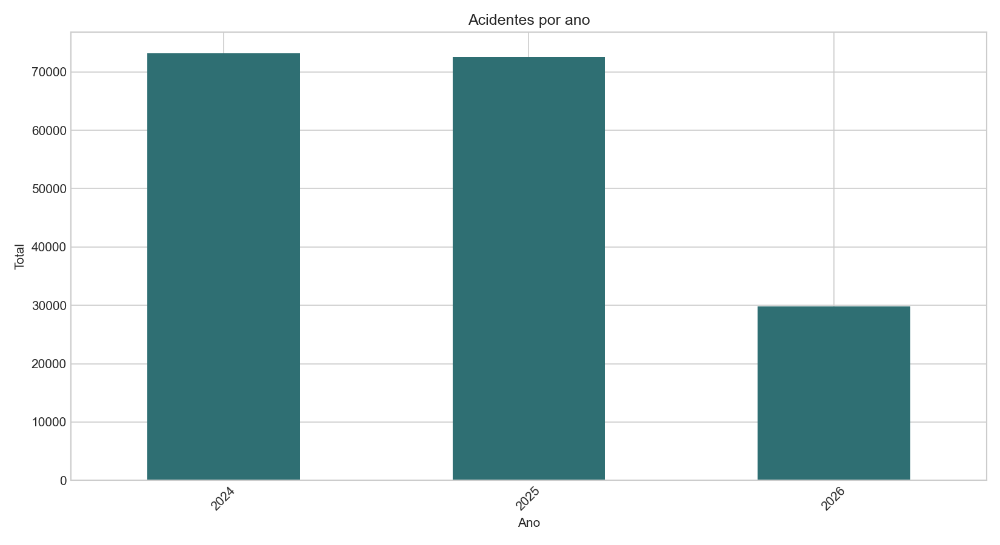

# Observatório de Acidentes de Trânsito no Brasil

Case de análise dos acidentes registrados pela Polícia Rodoviária Federal, com pipeline em Python, tratamento em Pandas, consultas SQL, testes de qualidade, relatório técnico e dashboard interativo em Streamlit.


[](https://github.com/josepedrosoaresdesouzanetto-max/observatorio-acidentes-transito/actions/workflows/tests.yml)

## Visão geral

O projeto transforma arquivos públicos da PRF em uma base analítica organizada por camadas. O fluxo padroniza os dados, cria variáveis temporais e de gravidade, executa verificações de qualidade e produz tabelas, gráficos, relatório e dashboard.

A pergunta central é: **quais fatores aparecem associados à ocorrência de acidentes fatais nas rodovias federais brasileiras?**

Para responder com cuidado, o projeto separa volume absoluto de fatalidade relativa e usa a variável `acidente_fatal`, derivada de `mortos`: uma ocorrência é classificada como fatal quando possui ao menos uma morte registrada.

Este trabalho nasceu como entrega acadêmica e foi estruturado como case de portfólio, com código, documentação, testes e limitações explícitas.

## Problema e objetivos

Contar acidentes não é suficiente para analisar gravidade. UFs e rodovias com mais registros podem não ser as mesmas com maior proporção de ocorrências fatais.

Os objetivos da análise são:

- comparar volume de acidentes, vítimas e percentual de fatalidade;
- observar padrões por UF, BR, município, período, causa registrada e condições da ocorrência;
- criar uma métrica educacional de risco que combine frequência e severidade;
- manter rastreabilidade entre dados brutos, tratados, modelados e artefatos finais;
- apresentar os resultados em formatos adequados para exploração e comunicação.

## Fonte e recorte dos dados

Os arquivos são públicos e disponibilizados no portal de [Dados Abertos da PRF](https://www.gov.br/prf/pt-br/acesso-a-informacao/dados-abertos/dados-abertos-da-prf).

O projeto trabalha com:

- **ocorrências (`datatran`):** uma linha por acidente, com data, horário, local, causa registrada, tipo de acidente, condições e totais de vítimas;
- **pessoas/envolvidos (`acidentes`):** registros dos envolvidos, utilizados como fonte complementar.

O relatório versionado utiliza **2024, 2025 e parte de 2026**, totalizando 175.459 ocorrências tratadas. Os arquivos de 2022 e 2023 foram mantidos no manifesto histórico, mas não entram no relatório principal atual.

> 2026 é um ano parcial no recorte versionado. Ele não deve ser comparado diretamente com anos completos sem essa ressalva.

Os CSVs brutos e processados não são enviados ao GitHub por causa do volume. O repositório mantém manifestos com nomes, anos, tamanhos e hashes SHA-256 dos arquivos usados para gerar os resultados.

## Tecnologias

- **Python 3.10+** para o pipeline e as rotinas de auditoria e sincronização.
- **Pandas** para leitura, limpeza, transformação e agregações.
- **SQL** para modelagem dimensional, views analíticas e testes de qualidade.
- **Streamlit e Plotly** para o dashboard interativo.
- **Matplotlib** para os gráficos do relatório.
- **Pytest** para testes unitários e verificações dependentes dos dados locais.
- **Jupyter Notebook** como roteiro complementar de exploração.

## Metodologia

1. **Ingestão:** localiza os CSVs por tipo e ano e trata separador e encoding.
2. **Limpeza:** padroniza colunas, tipos, datas, horários, nulos e duplicidades.
3. **Transformação:** cria atributos de tempo, gravidade, vítimas e fatalidade.
4. **Modelagem:** gera dimensões, fatos e agregações para análise.
5. **Qualidade:** verifica chaves, campos essenciais, valores inválidos e categorias raras.
6. **Análise:** compara contagens absolutas, proporções e recortes contextuais.
7. **Comunicação:** gera gráficos, relatório em Markdown e dashboard interativo.

O detalhamento está em [Metodologia](docs/04_metodologia.md), [Tratamento dos Dados](docs/05_tratamento_dos_dados.md) e [Modelagem dos Dados](docs/06_modelagem_dos_dados.md).

## Principais resultados

Os resultados abaixo pertencem ao recorte versionado e podem mudar quando novos arquivos forem processados.

| Indicador | Resultado |
| --- | ---: |
| Ocorrências tratadas | 175.459 |
| Ocorrências em 2024 | 73.156 |
| Ocorrências em 2025 | 72.529 |
| Ocorrências parciais em 2026 | 29.774 |
| UF com mais acidentes no recorte | MG — 22.622 |
| UF com maior percentual de acidentes fatais | MA — 19,14% |

Leituras principais:

- Volume de acidentes e fatalidade relativa respondem a perguntas diferentes e precisam ser apresentados separadamente.
- MG lidera em quantidade de acidentes no recorte, enquanto MA apresenta o maior percentual de ocorrências fatais.
- PA e RR também aparecem com percentuais de fatalidade elevados no recorte, apesar de volumes menores que os estados líderes em contagem.
- Causa registrada, tipo de acidente, fase do dia, clima e tipo de pista permitem identificar associações, mas não demonstram causalidade.
- O índice de risco ajuda a ordenar frequência e severidade, porém é uma métrica educacional, não um indicador oficial ou preditivo.

Consulte o [Relatório Final](relatorios/relatorio_final.md) para tabelas e interpretações completas.

## Visualizações



*O valor de 2026 representa apenas o período disponível no conjunto processado.*

Outros gráficos versionados cobrem UFs, horários, dias da semana, causas registradas, tipos de acidente, clima, gravidade, rodovias e índice de risco. Todos estão em [`relatorios/graficos/`](relatorios/graficos/).

## Dashboard

O dashboard em `dashboard/app.py` oferece:

- filtros por ano, UF, BR e outras dimensões disponíveis;
- indicadores de acidentes, vítimas e fatalidade;
- comparações temporais e geográficas;
- rankings e gráficos interativos;
- mapa do Brasil com recurso geográfico local.

Para executar:

```powershell
streamlit run dashboard/app.py
```

No Windows, também é possível usar `ABRIR_DASHBOARD.bat`.

## Estrutura do projeto

```text
observatorio-acidentes-transito/
|-- dados/                 manifestos, dicionário e dados locais ignorados
|-- dashboard/             aplicação Streamlit e recursos visuais
|-- docs/                  fonte, método, modelagem, LGPD e limitações
|-- notebooks/             roteiros complementares de exploração
|-- relatorios/            relatório, gráficos e tabelas versionados
|-- scripts/               automação de verificação no Windows
|-- sql/                   setup, carga, tratamento, modelo, views e testes
|-- src/                   pipeline e rotinas de qualidade
|-- testes/                testes unitários e de integração
|-- README.md
|-- requirements.txt
`-- pytest.ini
```

## Como reproduzir

### 1. Instale o ambiente

```powershell
git clone https://github.com/josepedrosoaresdesouzanetto-max/observatorio-acidentes-transito.git
cd observatorio-acidentes-transito
python -m venv .venv
.venv\Scripts\activate
python -m pip install -r requirements.txt
```

### 2. Obtenha os dados

Baixe os arquivos no portal da PRF e organize-os conforme [Fonte dos Dados](docs/02_fonte_dos_dados.md):

```text
dados/01_brutos/ocorrencia/acidentes_2025_ocorrencia.csv
dados/01_brutos/pessoa/acidentes_2025_pessoa.csv
```

A rotina de sincronização também pode localizar, baixar para uma pasta temporária e comparar um arquivo sem substituir automaticamente a base oficial:

```powershell
python -m src.sincronizar_dados_prf --verificar
python -m src.sincronizar_dados_prf --baixar-temporario --ano 2025 --tipo ocorrencias
python -m src.sincronizar_dados_prf --comparar --ano 2025 --tipo ocorrencias
```

Consulte [Sincronização dos Dados](docs/09_sincronizacao_dados_prf.md) antes de aplicar qualquer atualização.

### 3. Execute o pipeline

```powershell
python -m src.atualizar_projeto
```

Ou execute as etapas individualmente:

```powershell
python -m src.limpar_dados
python -m src.modelar_dados
python -m src.calcular_indice_risco
python -m src.gerar_graficos
python -m src.gerar_relatorio
```

### 4. Rode os testes

```powershell
python -m pytest -q
```

Em um clone sem os CSVs da PRF, os testes de integração marcados como `dados_locais` são ignorados com uma explicação; os testes unitários continuam executando normalmente. Com os arquivos locais disponíveis, toda a suíte é avaliada.

## Auditoria e atualização

Gerar o manifesto dos arquivos brutos e o relatório de qualidade:

```powershell
python -m src.auditar_dados
```

Verificar se a PRF publicou novos arquivos, sem sobrescrever a base local:

```powershell
python -m src.verificar_dados_publicos --salvar-relatorio
```

O projeto também inclui um script opcional para agendar essa verificação semanal no Windows. Relatórios operacionais e logs ficam em `logs/`, fora do versionamento.

## Privacidade e licenças

Os arquivos de dados não são distribuídos neste repositório. O pipeline inclui verificações para bloquear colunas potencialmente identificáveis antes de uma atualização. Consulte [LGPD e Privacidade](docs/07_lgpd_e_privacidade.md).

A licença MIT deste repositório se aplica ao código do projeto. Os dados continuam sujeitos aos termos e condições da fonte pública da PRF; o mapa local mantém sua atribuição em [`dashboard/assets/maps/README.md`](dashboard/assets/maps/README.md).

## Limitações

- O recorte cobre apenas acidentes em rodovias federais registrados pela PRF.
- O ano corrente é parcial quando aparece na análise.
- Diferenças de preenchimento e cobertura entre anos podem afetar comparações.
- Padrões observados indicam associação, não causalidade.
- Percentuais sem medidas externas de exposição — como fluxo de veículos, frota ou quilômetros percorridos — exigem interpretação cuidadosa.
- O índice de risco usa pesos definidos para fins educacionais e não foi validado por um órgão oficial.

## Próximos passos

- Adicionar capturas reais do dashboard ao repositório.
- Incorporar medidas externas de exposição ao risco, quando houver fontes compatíveis.
- Publicar uma demonstração online do dashboard com dados agregados.
- Ampliar os testes de integração do pipeline completo.

## Autor

Desenvolvido por [José Pedro Netto](https://github.com/josepedrosoaresdesouzanetto-max).
